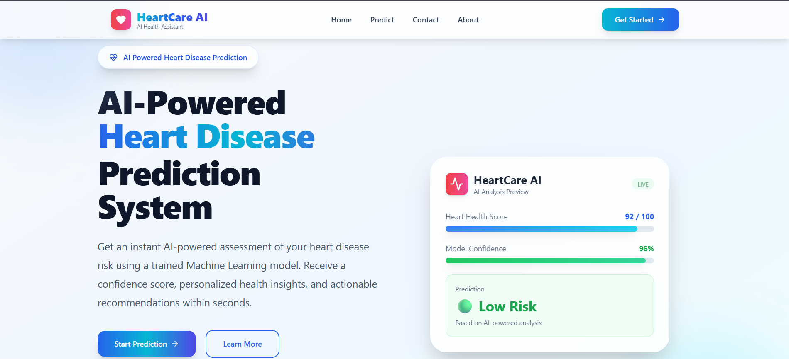
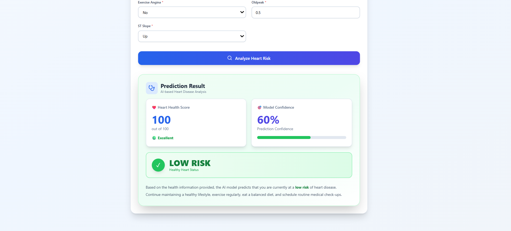
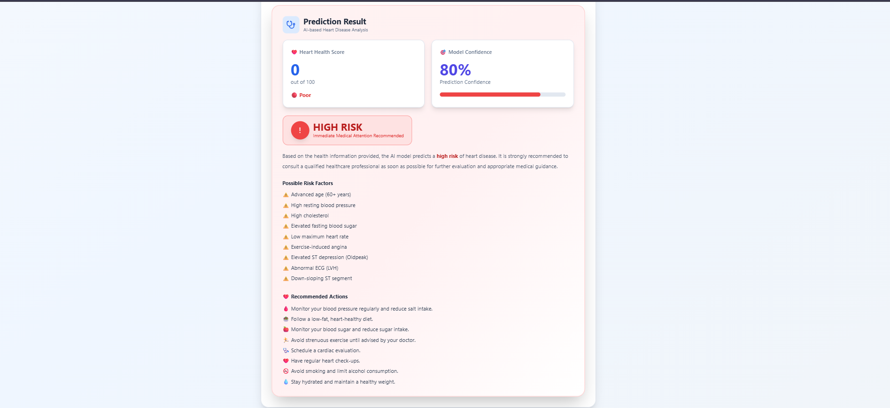

# ❤️ HeartCare AI

An AI-powered Heart Disease Prediction System built using **React, Flask, and Machine Learning**.

The application predicts whether a patient is at **Low Risk** or **High Risk** of heart disease based on medical parameters and provides a confidence score along with health recommendations.

---

## 🌐 Live Demo

### Frontend (Vercel)

👉 https://heart-care-ai-mu.vercel.app/

### Backend API (Render)

👉 https://heartcare-ai-se2v.onrender.com

---

## 📸 Application Screenshots

### 🏠 Home Page



---

### 🟢 Low Risk Prediction



---

### 🔴 High Risk Prediction



---

## ✨ Features

- 🤖 AI-powered heart disease prediction
- ❤️ Machine Learning model integration
- 📊 Prediction confidence score
- 📈 Heart Health Score
- 🟢 Low Risk & 🔴 High Risk prediction
- 💡 Personalized health recommendations
- ⚡ Fast prediction (under 2 seconds)
- 🎨 Modern responsive UI
- 🌙 Smooth page transition animations
- ☁️ Deployed using Vercel & Render

---

## 🛠 Tech Stack

### Frontend

- React
- Vite
- Tailwind CSS
- Framer Motion
- React Router
- Axios
- Lucide React

### Backend

- Flask
- Flask-CORS
- Pandas
- NumPy
- Joblib

### Machine Learning

- Scikit-learn
- K-Nearest Neighbors (KNN)

### Deployment

- Vercel
- Render
- GitHub

---

## ⚙️ Installation

### Clone Repository

```bash
git clone https://github.com/Chetan-Kokate-21/HeartCare-AI.git
```

---

### Frontend

```bash
cd frontend
npm install
npm run dev
```

Runs on:

```
http://localhost:5173
```

---

### Backend

```bash
cd backend
pip install -r requirements.txt
python app.py
```

Runs on:

```
http://127.0.0.1:5000
```

---

## 📂 Project Structure

```
HeartCare-AI
│
├── frontend
│   ├── src
│   ├── public
│   └── package.json
│
├── backend
│   ├── app.py
│   ├── KNN_heart.pkl
│   ├── scaler.pkl
│   ├── columns.pkl
│   └── requirements.txt
│
└── README.md
```

---

## 🧠 Machine Learning Workflow

1. User enters medical information.
2. React sends data to the Flask API.
3. Flask preprocesses the input.
4. Features are scaled using the trained scaler.
5. The trained KNN model predicts heart disease risk.
6. Prediction and confidence score are returned.
7. React displays the results with health recommendations.

---

## 📊 Prediction Output

The model returns:

- Heart Health Score
- Prediction Confidence
- Low Risk / High Risk
- Recommended Actions

---

## 🚀 Future Improvements

- User Authentication
- Prediction History
- PDF Report Generation
- Doctor Recommendation System
- AI Chat Assistant
- Dark Mode
- Multi-language Support

---

## 👨‍💻 Author

**Chetan Kokate**

GitHub:

https://github.com/Chetan-Kokate-21

---

## ⭐ Support

If you found this project useful, consider giving it a ⭐ on GitHub.